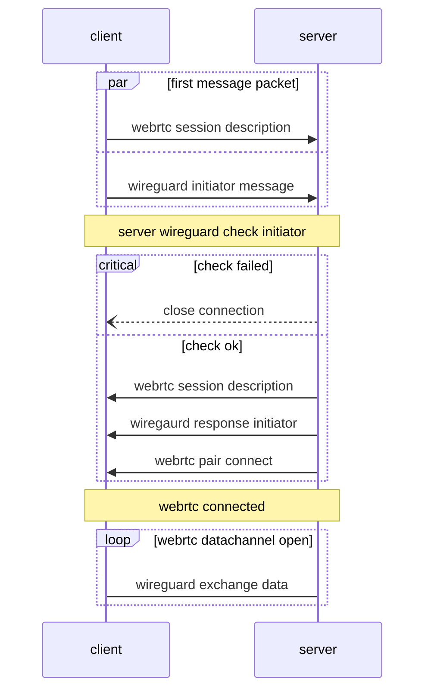

# wgortc (Wireguard Over Webrtc)

## How to Use

replace `conn.Bind` with this. more details see [example/main.go](./example/main.go)

```go
    // local signaler hub
	hub := local.NewHub()
	// client signaler, you can impl a custom signaler by youself
    signaler := local.NewServer()
	hub.Register("client", signaler)
	bind := wgortc.NewBind(signaler)
	dev = device.NewDevice(tun, bind, device.NewLogger(loglevel, "client"))
```

## Custom Signaler Server

implement the `signaler.Channel` interface

```go
package signaler

import "github.com/pion/webrtc/v3"

type SDP = webrtc.SessionDescription

type Channel interface {
	Handshake(endpoint string, offer SDP) (answer *SDP, err error)
	Accept() (offerCh <-chan Session, err error)

	Close() error
}

type Session interface {
	Description() (offer SDP)
	Resolve(answer *SDP) (err error)
	Reject(err error)
}
```

## 如何建立连接


